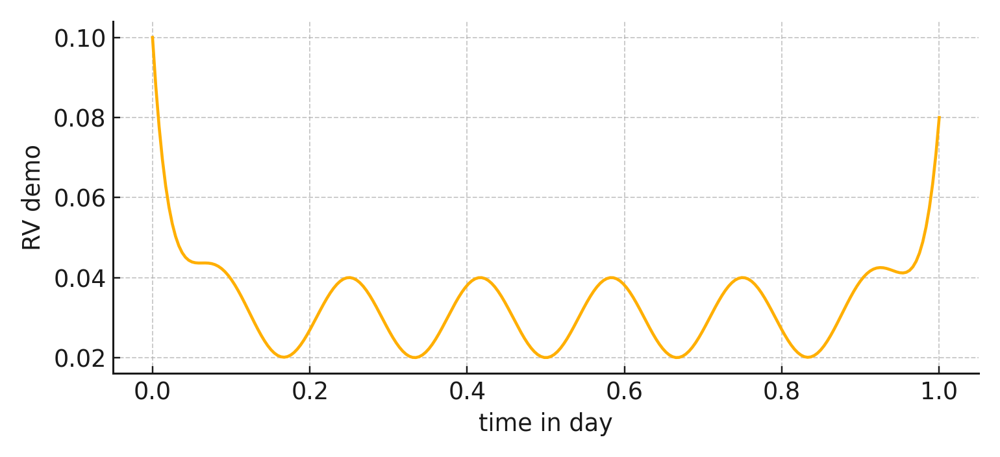

Intraday Volatility Forecasting
================================

This project is my work on short horizon volatility modeling for equities and FX.  
I built realized volatility estimators at multiple horizons, compared them with simple forecasting models, and analyzed how they perform in and out of sample.  
The repo is a cleaned up version of my Berkeley research, rewritten to look like a standalone project.

My motivation
-------------
I wanted to study how volatility clusters within the trading day and whether simple models can capture these patterns.  
My goal was to make the code reusable so that anyone can plug in new data and run the pipeline without extra effort.

What I did
----------
I computed realized volatility using one minute returns, aggregated at ten, thirty, and sixty minute horizons.  
I estimated OLS regressions with multi horizon inputs and compared them to AR models with six lags.  
I applied this both to equities such as Microsoft and Quantum Computing, and to currency pairs like EURUSD, EURJPY, and USDJPY.  
I documented the results in notebooks and summarized the findings in a short research note.

Why this matters
----------------
Volatility is at the heart of risk and trading decisions.  
By showing how predictability appears and disappears at different horizons, I built intuition about microstructure noise, persistence, and mean reversion.  
This kind of work helps design better signals and avoid overfitting when building real strategies.

Repo contents
-------------
src/ivf          my Python package with estimators, models, and plotting tools  
notebooks        my Jupyter notebooks for equities and FX  
docs             my research note with results and interpretations  
assets           my demo figures that render in the README  
data             a folder for sample or user supplied data  
results          a folder where I saved output figures and tables  

How to run
----------
1. Create a fresh environment  
2. Install dependencies with `pip install -r requirements.txt`  
3. Open one of the notebooks under notebooks/ and run end to end  
4. Check the docs/ folder for a compact research summary  

Preview
-------

Credit
------
This is my own work carried out during my time at Berkeley, repackaged here as a clean research project.
